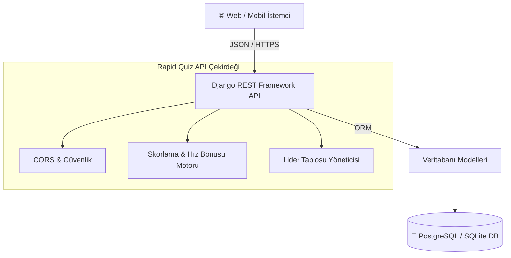

# ⚡ Rapid Quiz — Backend API

<div align="center">


**Hızlı düşünme, anlık refleks ve rekabet odaklı 5 saniyelik quiz platformunun RESTful API servisi.**

[Canlı API](https://rapid-quiz-backend.onrender.com/api/v1/categories/) • [Frontend Reposu](https://github.com/bisraunal/RapidQuizFrontend)

</div>

---

## 📖 Genel Bakış (Overview)

Rapid Quiz Backend, mobil ve web istemcilerine yüksek performanslı, güvenli ve hile korumalı REST API hizmeti sunan Headless Django mimarisidir.

### ✨ Öne Çıkan Özellikler
* 🛡️ **Hile Korumalı Soru Teslimi:** Quiz esnasında doğru şıklar (`is_correct`) istemciye gönderilmez. Doğrulama sunucu tarafında yapılır.
* ⚡ **Dinamik Hız Bonusu Formülü:** Taban 10 puana ek olarak kalan süreye göre anlık hız puanı hesaplama (`Puan = 10 + (Kalan Süre * 2)`).
* 🏆 **Canlı Lider Tablosu (Top 10):** Kategori bazlı ve global lider tabloları.
* 📚 **Eğitici Sonuç Analizi:** Quiz bitiminde detaylı doğru/yanlış ve süre analizi dökümü.
* 📦 **6 Kategori & 120 Soru (Seed Data):** Yazılım, Yapay Zeka, Bilgisayar Mühendisliği, Ülkeler, Fizik ve Futbol.

---

## 🏛️ Sistem Mimarisi



---

## 🔌 API Uç Noktaları (Endpoints)

| Metot | Uç Nokta | Açıklama |
| :--- | :--- | :--- |
| `GET` | `/api/v1/categories/` | Aktif 6 kategoriyi ve soru sayılarını listeler |
| `GET` | `/api/v1/categories/{slug}/questions/` | Kategoriye ait 20 soruyu döner (`is_correct` gizlidir) |
| `POST` | `/api/v1/quiz/submit/` | Cevapları doğrular, skoru hesaplar ve Top 10 ile döner |
| `GET` | `/api/v1/leaderboard/?category={slug}` | Kategori bazlı Top 10 skorbordu |
| `GET` | `/api/v1/leaderboard/global/` | Genel (Tüm kategoriler) Top 10 skorbordu |

---

## 🚀 Yerel Geliştirme (Local Setup)

### 1. Bağımlılıkları Yükleyin
```bash
python -m venv .venv
source .venv/bin/activate  # Windows: .\.venv\Scripts\activate
pip install -r requirements.txt
```

### 2. Migrasyonları ve Başlangıç Verilerini Yükleyin
```bash
python manage.py migrate
python manage.py seed_quiz_data
```

### 3. Sunucuyu Başlatın
```bash
python manage.py runserver 127.0.0.1:8000
```

### 4. Testleri Çalıştırın
```bash
python manage.py test
```

---

## 🐳 Docker ile Çalıştırma

```bash
docker-compose up --build
```
