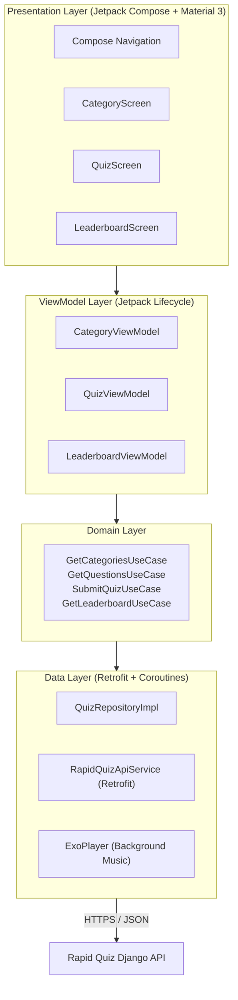

# 📱 Rapid Quiz — Android Mobil Uygulama Proje Dokümanı & Mimari Rehberi

---

## 1. Proje Genel Bakışı (Project Overview)

**Rapid Quiz Android**, backend tarafında yayında olan Django REST Framework servisiyle haberleşen; refleks, hız ve bilgi odaklı (soru başına 5 saniye) modern bir **Native Android** mobil oyun uygulamasıdır.

* **Platform:** Android (minSdk: 26, targetSdk: 35)
* **Programlama Dili:** Kotlin
* **UI Toolkit:** Jetpack Compose & Material Design 3
* **Mimari:** MVVM + Clean Architecture (Presentation, Domain, Data)
* **Kullanıcı Modeli:** Anonim / Misafir (Guest) — Giriş yapmadan anında quiz ve skor gönderimi.

---

## 2. Sistem Kontrolü & Canlı Durum Raporu (System Health Check)

Mobil geliştirmeye başlamadan önce backend servisinin tüm bileşenleri yerel ve canlı ortamda test edilmiştir:

| Kontrol Noktası | Test Edilen Durum | Sonuç | Açıklama |
| :--- | :--- | :--- | :--- |
| **Birim Testleri (Unit Tests)** | `python manage.py test` | **4/4 BAŞARILI** (0.067s) | Endpoint'ler, skor motoru ve yetkilendirme doğrulandı |
| **Veritabanı Varlığı** | SQLite / PostgreSQL | **AKTİF & DOLU** | 7 Kategori, 140 Soru, 560 Seçenek hazır |
| **Canlı Sunucu (Production)** | `https://rapid-quiz-backend.onrender.com` | **AKTİF (HTTP 200)** | 7 aktif kategori ve soru adetleri canlıdan doğrulandı |
| **Hile Koruması** | `GET /questions/` | **GÜVENLİ** | `is_correct` alanı istemciye gönderilmiyor |

### Mobil Başlangıcı Öncesi Backend Değişiklik İhtiyacı:
> **Backend tarafında herhangi bir kod veya veritabanı değişikliğine GEREK YOKTUR.**
> Backend API'si, Android mobil istemcilerin doğrudan bağlanabileceği şekilde RESTful standartlarında, CORS bağımsız ve JSON formatında hazır durumdadır.
> 
> *Teknik Tavsiye:* Render ücretsiz sunucusunun uyku modundan (cold-start) uyanması ilk istekte ~30-45 saniye sürebildiğinden, Android tarafında `OkHttpClient` zaman aşımı (Timeout) süresi **30-60 saniye** olarak yapılandırılmalıdır.

---

## 3. Mobil Uygulama Mimarisi & Teknoloji Yığını (Tech Stack)



### 3.1. Kullanılacak Kütüphaneler & Bağımlılıklar

| Kütüphane / Modül | Kullanım Amacı |
| :--- | :--- |
| **Jetpack Compose (BOM)** | Modern, bildirimsel (declarative) reaktif UI |
| **Material 3** | Güncel Android renk temaları, kartlar, chip'ler ve animasyonlar |
| **Navigation Compose** | Ekranlar arası type-safe rota yönetimi |
| **Retrofit 2 + OkHttp 3** | REST API haberleşmesi, logging interceptor ve timeout yönetimi |
| **Kotlinx Serialization / Gson** | JSON serileştirme ve model eşleme |
| **Kotlin Coroutines & Flow** | Asenkron işlemler, sayaç (timer) ve UI state yönetimi |
| **Hilt (Dagger)** | Dependency Injection (Bağımlılık Enjeksiyonu) |
| **Media3 / ExoPlayer** | Kategoriye özel arka plan müziklerinin akıcı çalınması |
| **Coil Compose** | Asenkron ikon/görsel yükleme |

---

## 4. Kullanıcı Akışı ve Ekran Tasarımları (Screens & Flows)

Mobil uygulama toplam **3 ana ekrandan** oluşacaktır:

### 4.1. Ekran 1: Kategori Seçim & Ana Ekran (`CategoryScreen`)
* **Amaç:** Kullanıcının uygulamayı açtığında 7 kategoriyi listelemesi ve quizi başlatması.
* **Bileşenler:**
  - **TopAppBar:** Rapid Quiz logosu, başlık ve sağ üst köşede **Lider Tablosu (Trophy 🏆)** ikonu.
  - **LazyVerticalGrid / LazyColumn:** 7 kategori kartı.
    - Kategori Adı (Örn: *Yazılım, Fizik, Yapay Zeka*)
    - Kategori İkonu & Renk Teması (Örn: `#00F0FF`, `#A855F7`)
    - Soru Sayısı Rozeti (*"20 Soru - 5sn/Soru"*)
    - Müzik Başlığı (*"Cyber City - Synthwave"*)
  - Kategori kartına tıklandığında `QuizScreen(categorySlug)` rotasına yönlendirilir.

### 4.2. Ekran 2: Quiz & Refleks Ekranı (`QuizScreen`)
* **Amaç:** 5 saniyelik geri sayım eşliğinde 20 sorunun tek tek cevaplanması ve sonucun gönderilmesi.
* **Bileşenler:**
  - **Üst Çubuk:** Soru Sayacı (Örn: `Soru 3 / 20`), Çıkış Butonu, Müzik Aç/Kapat Butonu.
  - **Dinamik Geri Sayım Barı:** 5.0 saniyeden 0.0 saniyeye doğru azalan progress bar (Yeşil ➔ Sarı ➔ Kırmızı renk geçişi).
  - **Soru Kartı:** Soru metni + (Varsa) Kod/Formül parçacığı (koyu monospace kutu).
  - **4 Şık Butonu:** A, B, C, D seçenekleri.
  - **Oyun Mekaniği:**
    - Şık seçildiğinde veya 5 saniye dolduğunda geçen süre (`time_taken`) milisaniye hassasiyetinde kaydedilir.
    - Şık seçildikten 0.5 saniye sonra otomatik bir sonraki soruya geçer.
    - 20. soru bittiğinde **Quiz Tamamlama Modalı (Sonuç Diyaloğu)** açılır.
  - **Sonuç / Submit Bölümü:**
    - Doğru, Yanlış, Boş sayıları ve Geçen Toplam Süre özeti gösterilir.
    - "Takma Adınız (Nickname)" text input alanı yer alır.
    - "Skoru Kaydet" butonuna basıldığında `POST /api/v1/quiz/submit/` isteği atılır.
    - Başarılı yanıttan sonra gelen sıralama (Rank) ve Top 10 verisiyle kullanıcı doğrudan `LeaderboardScreen`'e yönlendirilir veya sonuç kartında gösterilir.

### 4.3. Ekran 3: Lider Tablosu Ekranı (`LeaderboardScreen`)
* **Amaç:** Web'deki yapının aynısı olarak, tek bir ekranda tüm kategoriler ve global liderlik tablosunu filtrelemek.
* **Bileşenler:**
  - **Yatay Sekme Çubuğu (ScrollableTabRow / FilterChips):**
    - `[ 🌐 Genel | 🍳 Aşçılık | 💻 Yazılım | 🤖 Yapay Zeka | ⚙️ Bilg. Müh. | ⚛️ Fizik | 🏆 Futbol | 🌍 Ülkeler ]`
  - **Lider Listesi (LazyColumn):**
    - Sıralama Rozeti (#1 Altın 🥇, #2 Gümüş 🥈, #3 Bronz 🥉, #4-#10 standart).
    - Oyuncu Adı
    - Toplam Puan (Büyük vurgulu)
    - Doğru / Yanlış / Boş detay rozetleri
    - Toplam Süre (Örn: `24.5s`)
  - Sekme değiştiğinde anında ilgili kategori için API'ye istek atılır ve liste güncellenir. Ayrı bir ekrana gerek yoktur.

---

## 5. API Uç Noktaları ve İstek/Yanıt Sözleşmeleri (API Contract)

### Temel URL Bilgileri
* **Canlı API Base URL (Production):** `https://rapid-quiz-backend.onrender.com/api/v1/`
* **Android Emülatör Yerel Base URL (Local Debug):** `http://10.0.2.2:8000/api/v1/`

---

### 5.1. Kategorileri Listeleme
* **Uç Nokta (URL):** `https://rapid-quiz-backend.onrender.com/api/v1/categories/`
* **HTTP Metodu:** `GET`
* **Açıklama:** Uygulama açılışında 7 aktif kategoriyi listeler.

#### Yanıt (JSON Response - 200 OK):
```json
[
  {
    "id": "87f08a74-fa8d-4622-8898-d1483351c9a1",
    "name": "Yazılım",
    "slug": "yazilim",
    "icon": "Code2",
    "color_theme": "cyan",
    "music_url": "https://assets.mixkit.co/music/preview/mixkit-cyber-city-110.mp3",
    "music_title": "Cyber City - Synthwave Code Beat",
    "is_active": true,
    "question_count": 20
  },
  {
    "id": "33383000-04ad-453e-a76e-819d2bc08166",
    "name": "Yapay Zeka",
    "slug": "yapay-zeka",
    "icon": "Bot",
    "color_theme": "purple",
    "music_url": "https://assets.mixkit.co/music/preview/mixkit-tech-house-vibes-130.mp3",
    "music_title": "Neural Network - Futuristic Tech Beats",
    "is_active": true,
    "question_count": 20
  }
]
```

---

### 5.2. Kategoriye Ait Soruları Getirme
* **Uç Nokta (URL):** `https://rapid-quiz-backend.onrender.com/api/v1/categories/{slug}/questions/`
* **Örnek URL:** `https://rapid-quiz-backend.onrender.com/api/v1/categories/yazilim/questions/`
* **HTTP Metodu:** `GET`
* **Açıklama:** Seçilen kategoriye ait 20 soruyu ve şıklarını döner. Doğru şık (`is_correct`) hileyi önlemek için gizlidir.

#### Yanıt (JSON Response - 200 OK):
```json
{
  "category": "Yazılım",
  "category_slug": "yazilim",
  "icon": "Code2",
  "color_theme": "cyan",
  "music_url": "https://assets.mixkit.co/music/preview/mixkit-cyber-city-110.mp3",
  "music_title": "Cyber City - Synthwave Code Beat",
  "time_per_question": 5,
  "total_questions": 20,
  "questions": [
    {
      "id": "e8d64115-46aa-4c17-9da5-35c8e31ee33e",
      "text": "Python'da hangi veri tipi 'immutable' (değiştirilemez) özelliğe sahiptir?",
      "code_snippet": "x = (1, 2, 3)\nx[0] = 5  # TypeError!",
      "points": 10,
      "order": 1,
      "choices": [
        {
          "id": "8aa1869e-5e2a-43d9-9524-7da65ae4bf9a",
          "text": "List"
        },
        {
          "id": "c6204780-60b6-4dd8-bc2a-cb7217332f14",
          "text": "Tuple"
        },
        {
          "id": "902d1378-59ea-47a4-9da2-0be4b22c7104",
          "text": "Dict"
        },
        {
          "id": "439b1a59-c2c6-4357-9d7e-0ba5c65f9a62",
          "text": "Set"
        }
      ]
    }
  ]
}
```

---

### 5.3. Quiz Skorunu Gönderme ve Hesaplatma (Submit)
* **Uç Nokta (URL):** `https://rapid-quiz-backend.onrender.com/api/v1/quiz/submit/`
* **HTTP Metodu:** `POST`
* **Content-Type:** `application/json`
* **Açıklama:** Kullanıcının 20 soruya verdiği yanıtları ve her sorudaki tepki sürelerini (`time_taken`) sunucuya iletir. Sunucu doğru/yanlış/hız bonusunu hesaplar, skoru kaydeder ve ilk 10 listesiyle döner.

#### İstek Gövdesi (JSON Request Body):
```json
{
  "category_slug": "yazilim",
  "player_name": "AhmetKaya",
  "answers": [
    {
      "question_id": "e8d64115-46aa-4c17-9da5-35c8e31ee33e",
      "selected_choice_id": "c6204780-60b6-4dd8-bc2a-cb7217332f14",
      "time_taken": 1.45
    },
    {
      "question_id": "f5a72289-56cc-4b28-8de6-45d9f42ff44f",
      "selected_choice_id": null,
      "time_taken": 5.0
    }
  ]
}
```

#### Yanıt (JSON Response - 201 Created):
```json
{
  "score_id": "1b9d6bcd-bbfd-4b2d-9b5d-ab8dfbbd4bed",
  "player_name": "AhmetKaya",
  "category_name": "Yazılım",
  "category_slug": "yazilim",
  "total_score": 348,
  "correct_count": 18,
  "wrong_count": 1,
  "empty_count": 1,
  "total_time_taken": 42.3,
  "rank": 3,
  "results_breakdown": [
    {
      "question_id": "e8d64115-46aa-4c17-9da5-35c8e31ee33e",
      "question_text": "Python'da hangi veri tipi 'immutable' özelliğe sahiptir?",
      "code_snippet": null,
      "selected_choice_id": "c6204780-60b6-4dd8-bc2a-cb7217332f14",
      "selected_choice_text": "Tuple",
      "correct_choice_id": "c6204780-60b6-4dd8-bc2a-cb7217332f14",
      "correct_choice_text": "Tuple",
      "is_correct": true,
      "time_taken": 1.45,
      "earned_points": 17
    }
  ],
  "top_10": [
    {
      "id": "7a8b9c-...",
      "player_name": "ŞampiyonKodcu",
      "total_score": 380,
      "correct_count": 20,
      "wrong_count": 0,
      "empty_count": 0,
      "total_time_taken": 31.2,
      "category_name": "Yazılım",
      "category_slug": "yazilim",
      "created_at": "2026-10-02T15:20:00Z"
    }
  ]
}
```

---

### 5.4. Kategori Bazlı Skor Tablosu
* **Uç Nokta (URL):** `https://rapid-quiz-backend.onrender.com/api/v1/leaderboard/?category={slug}`
* **Örnek URL:** `https://rapid-quiz-backend.onrender.com/api/v1/leaderboard/?category=yazilim`
* **HTTP Metodu:** `GET`

#### Yanıt (JSON Response - 200 OK):
```json
{
  "category": "Yazılım",
  "category_slug": "yazilim",
  "leaderboard": [
    {
      "id": "score-uuid",
      "player_name": "DevNinja",
      "total_score": 392,
      "correct_count": 20,
      "wrong_count": 0,
      "empty_count": 0,
      "total_time_taken": 28.4,
      "category_name": "Yazılım",
      "category_slug": "yazilim",
      "created_at": "2026-10-01T19:45:00Z"
    }
  ]
}
```

---

### 5.5. Genel (Global) Skor Tablosu
* **Uç Nokta (URL):** `https://rapid-quiz-backend.onrender.com/api/v1/leaderboard/global/`
* **HTTP Metodu:** `GET`

#### Yanıt (JSON Response - 200 OK):
```json
{
  "category": "Global",
  "category_slug": "global",
  "leaderboard": [
    {
      "id": "score-uuid",
      "player_name": "GlobalChampion",
      "total_score": 400,
      "correct_count": 20,
      "wrong_count": 0,
      "empty_count": 0,
      "total_time_taken": 22.1,
      "category_name": "Yapay Zeka",
      "category_slug": "yapay-zeka",
      "created_at": "2026-10-02T12:00:00Z"
    }
  ]
}
```

---

## 6. Kotlin Veri Modelleri (DTOs) ve Retrofit Servis Tanımı

```kotlin
package com.rapidquiz.data.remote

import com.google.gson.annotations.SerializedName
import retrofit2.http.*

// 1. Kategori Modeli
data class CategoryDto(
    @SerializedName("id") val id: String,
    @SerializedName("name") val name: String,
    @SerializedName("slug") val slug: String,
    @SerializedName("icon") val icon: String,
    @SerializedName("color_theme") val colorTheme: String,
    @SerializedName("music_url") val musicUrl: String?,
    @SerializedName("music_title") val musicTitle: String?,
    @SerializedName("question_count") val questionCount: Int
)

// 2. Soru ve Şık Modelleri
data class CategoryQuestionsResponse(
    @SerializedName("category") val category: String,
    @SerializedName("category_slug") val categorySlug: String,
    @SerializedName("icon") val icon: String,
    @SerializedName("color_theme") val colorTheme: String,
    @SerializedName("music_url") val musicUrl: String?,
    @SerializedName("music_title") val musicTitle: String?,
    @SerializedName("time_per_question") val timePerQuestion: Int,
    @SerializedName("total_questions") val totalQuestions: Int,
    @SerializedName("questions") val questions: List<QuestionDto>
)

data class QuestionDto(
    @SerializedName("id") val id: String,
    @SerializedName("text") val text: String,
    @SerializedName("code_snippet") val codeSnippet: String?,
    @SerializedName("points") val points: Int,
    @SerializedName("order") val order: Int,
    @SerializedName("choices") val choices: List<ChoiceDto>
)

data class ChoiceDto(
    @SerializedName("id") val id: String,
    @SerializedName("text") val text: String
)

// 3. Quiz Submit İstek & Yanıt Modelleri
data class QuizSubmitRequest(
    @SerializedName("category_slug") val categorySlug: String,
    @SerializedName("player_name") val playerName: String,
    @SerializedName("answers") val answers: List<AnswerSubmissionDto>
)

data class AnswerSubmissionDto(
    @SerializedName("question_id") val questionId: String,
    @SerializedName("selected_choice_id") val selectedChoiceId: String?,
    @SerializedName("time_taken") val timeTaken: Double
)

data class QuizSubmitResponse(
    @SerializedName("score_id") val scoreId: String,
    @SerializedName("player_name") val playerName: String,
    @SerializedName("category_name") val categoryName: String,
    @SerializedName("category_slug") val categorySlug: String,
    @SerializedName("total_score") val totalScore: Int,
    @SerializedName("correct_count") val correctCount: Int,
    @SerializedName("wrong_count") val wrongCount: Int,
    @SerializedName("empty_count") val emptyCount: Int,
    @SerializedName("total_time_taken") val totalTimeTaken: Double,
    @SerializedName("rank") val rank: Int,
    @SerializedName("top_10") val top10: List<ScoreDto>
)

// 4. Lider Tablosu Modelleri
data class LeaderboardResponse(
    @SerializedName("category") val category: String,
    @SerializedName("category_slug") val categorySlug: String,
    @SerializedName("leaderboard") val leaderboard: List<ScoreDto>
)

data class ScoreDto(
    @SerializedName("id") val id: String,
    @SerializedName("player_name") val playerName: String,
    @SerializedName("total_score") val totalScore: Int,
    @SerializedName("correct_count") val correctCount: Int,
    @SerializedName("wrong_count") val wrongCount: Int,
    @SerializedName("empty_count") val emptyCount: Int,
    @SerializedName("total_time_taken") val totalTimeTaken: Double,
    @SerializedName("category_name") val categoryName: String,
    @SerializedName("category_slug") val categorySlug: String,
    @SerializedName("created_at") val createdAt: String
)

// Retrofit API Interface
interface RapidQuizApiService {
    @GET("categories/")
    suspend fun getCategories(): List<CategoryDto>

    @GET("categories/{slug}/questions/")
    suspend fun getCategoryQuestions(@Path("slug") slug: String): CategoryQuestionsResponse

    @POST("quiz/submit/")
    suspend fun submitQuiz(@Body request: QuizSubmitRequest): QuizSubmitResponse

    @GET("leaderboard/")
    suspend fun getLeaderboard(@Query("category") categorySlug: String): LeaderboardResponse

    @GET("leaderboard/global/")
    suspend fun getGlobalLeaderboard(): LeaderboardResponse
}
```

---

## 7. Android Proje Paket Hiyerarşisi (Package Structure)

```text
com.rapidquiz
│
├── data
│   ├── model          // DTO ve Entity modelleri
│   ├── remote         // Retrofit ApiService, Interceptor'lar
│   └── repository     // QuizRepositoryImpl
│
├── domain
│   ├── model          // Domain modelleri (Category, Question, Score)
│   ├── repository     // QuizRepository arayüzü
│   └── usecase        // GetCategoriesUseCase, SubmitQuizUseCase, vb.
│
├── di                 // Hilt Dependency Injection modülleri (NetworkModule, RepositoryModule)
│
├── ui
│   ├── theme          // Color, Type, Shape, Theme.kt (Neon Cyberpunk palet)
│   ├── components     // CountdownTimerBar, ChoiceButton, ResultCard, TopBar
│   ├── categories     // CategoryScreen, CategoryViewModel, CategoryUiState
│   ├── quiz           // QuizScreen, QuizViewModel, QuizUiState
│   ├── leaderboard    // LeaderboardScreen, LeaderboardViewModel, LeaderboardUiState
│   └── navigation     // NavGraph, Screen (Sealed class)
│
└── util               // SoundManager (ExoPlayer), Constants, Extensions
```

---

## 8. Başlangıç Kontrol Listesi (Action Checklist)

- [x] Backend birim testleri doğrulandı (`manage.py test`).
- [x] Canlı API endpoint'lerinin çalıştığı doğrulandı (`https://rapid-quiz-backend.onrender.com`).
- [x] Backend veri modelleri ve seed verileri (140 soru) onaylandı.
- [ ] Android Studio'da yeni bir **Empty Compose Activity** projesi oluşturulması.
- [ ] `build.gradle.kts` dosyasına Retrofit, Hilt, Navigation Compose ve Media3 kütüphanelerinin eklenmesi.
- [ ] API katmanı ve veri modellerinin projeye aktarılması.
- [ ] Ekranların ve 5 saniyelik zamanlayıcı bileşeninin kodlanması.
