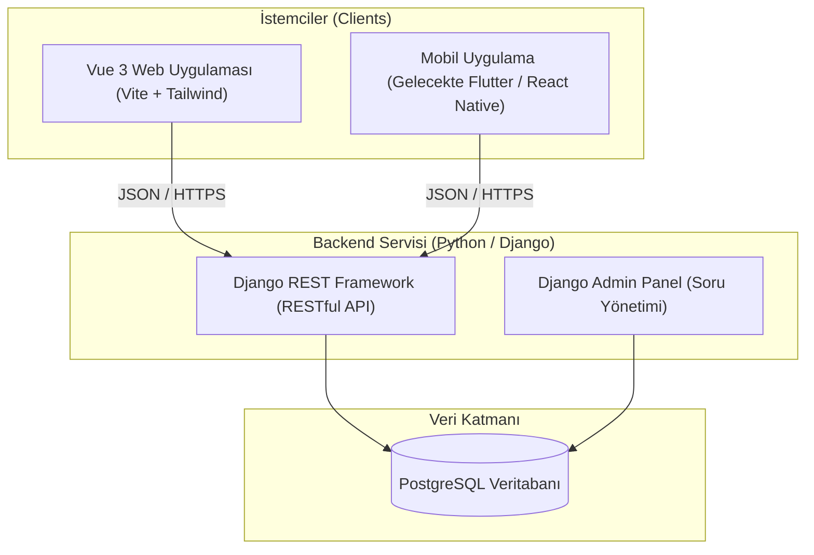
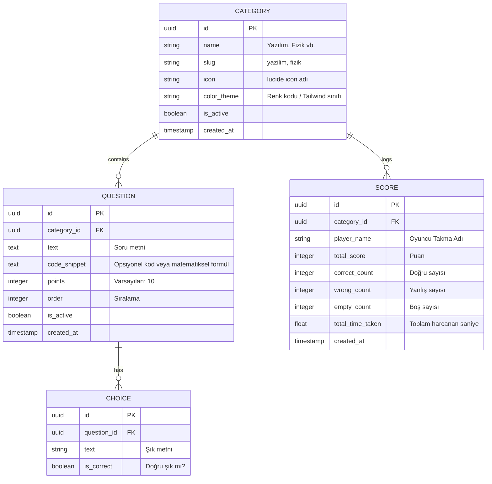
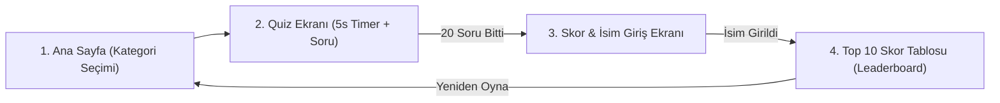
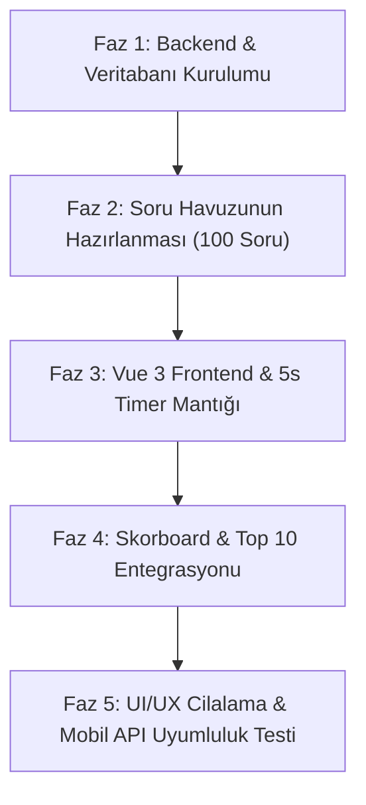

# 🚀 Rapid Quiz — Proje Tasarım ve Mimari Dokümanı

---

## 1. Proje Genel Bakışı (Project Overview)

**Rapid Quiz**, kullanıcıların 5 farklı kategoride bilgilerini ve reflekslerini test edebilecekleri, dinamik, hızlı tempolu ve kullanıcı kaydı gerektirmeyen modern bir web/mobil quiz platformudur.

* **Proje Adı:** Rapid Quiz
* **Temel Konsept:** Hızlı düşünme, anlık refleks (Soru başına 5 saniye kısıtı).
* **Hedef Kitle:** Gençler, öğrenciler, teknoloji ve genel kültür meraklıları (Canlı, enerjik, oyunlaştırılmış UI/UX).
* **Kullanıcı Modeli:** Misafir (Guest/Anonymous) tabanlı — Üyelik/Giriş zorunluluğu yoktur.

---

## 2. Temel Fonksiyonel Gereksinimler (Functional Requirements)

### 2.1. Kategoriler (7 Kategori) & Kategoriye Özel Fon Müzikleri
1. 💻 **Yazılım (Software)** — *Cyber City (Synthwave Code Beat)*
2. 🤖 **Yapay Zeka (Artificial Intelligence)** — *Neural Network (Futuristic Tech Beats)*
3. ⚙️ **Bilgisayar Mühendisliği (Computer Engineering)** — *Logic Gate (Retro 8-bit Pulse)*
4. 🌍 **Ülkeler (Countries & Geography)** — *World Odyssey (Global Acoustic Journey)*
5. ⚛️ **Fizik (Physics)** — *Cosmic Horizon (Deep Space Ambient)*
6. 🏆 **Futbol (Football)** — *Stadium Champions (Energetic Rock Beat)*
7. 🍳 **Aşçılık (Cooking & Gastronomy)** — *Bistro Gourmet (Cozy Kitchen Bossa Nova)*

### 2.2. Oyun Mekaniği & Akış
1. **Kategori Seçimi:** Kullanıcı ana ekranda 5 kategoriden birini seçer.
2. **Soru Havuzu:** Seçilen kategoriye ait **20 adet soru** API'den çekilir (isteğe bağlı rastgele sıralanır).
3. **Tekli Soru Ekranı:** Her soru bağımsız bir ekranda tek tek gösterilir. Soru cevaplanmadan veya süresi dolmadan sonraki soruya geçilemez.
4. **5 Saniye Geri Sayım:**
   - Her soru için tam **5 saniye** süre tanımlanır.
   - Görsel bir dairesel veya yatay geri sayım barı bulunur.
   - Süre dolduğunda cevap verilmemişse otomatik olarak sonraki soruya geçilir (0 puan / Yanlış kabul edilir).
5. **Anlık Geribildirim:** Kullanıcı şıkkı seçtiğinde (veya süre bittiğinde) doğru/yanlış durumu anlık animasyonla vurgulanır ve 0.5 - 1 saniye içinde sonraki soruya akar.
6. **Quiz Tamamlama & Skor:**
   - 20 soru sonunda toplam doğru, yanlış, boş ve süre bazlı skor hesaplanır.
   - Kullanıcıdan bir **İsim / Takma Ad (Nickname)** girmesi istenir.
   - İsim girilip gönderildiğinde skor veritabanına kaydedilir.
7. **Lider Tablosu (Leaderboard - Top 10):**
   - Skor gönderildikten sonra ilgili kategorinin (veya genel) **En İyi 10 (Top 10)** oyuncusu gösterilir.
   - Kullanıcının kendi derecesi vurgulanır.
   - "Yeniden Oyna" veya "Kategori Değiştir" butonlarıyla yeni oyun başlatılabilir.

---

## 3. Sistem Mimarisi & Teknoloji Yığını (Tech Stack)

Uygulama, gelecekteki **mobil uygulama entegrasyonu (React Native / Flutter / iOS-Android)** göz önüne alınarak **Headless / API-First** mimarisinde tasarlanmıştır.



### 3.1. Güncel Teknoloji ve Versiyon Matrisi (En Son Sürümler)

Gelecekte uyumsuzluk veya destek sonu (EOL) yaşamamak adına projedeki tüm kütüphane ve çalışma ortamları **en güncel stabil sürümler** baz alınarak belirlenmiştir:

| Katman / Bileşen | Kullanılacak Teknoloji | Güncel Versiyon | Rol / Açıklama |
| :--- | :--- | :--- | :--- |
| **Backend Runtime** | Python | `3.12+` / `3.14` | Yüksek performanslı Python çalışma ortamı |
| **Web Framework** | Django | `6.1+` (veya `5.2 LTS`) | Güvenli ORM, Admin paneli ve çekirdek backend |
| **API Framework** | Django REST Framework | `3.18+` | RESTful API serialization ve viewset yapıları |
| **CORS Middleware** | django-cors-headers | `4.7+` | Web (Vue) ve Mobil çapraz kaynak izinleri |
| **Database Driver** | psycopg (v3) | `3.2+` | Modern, async uyumlu PostgreSQL sürücüsü |
| **Veritabanı** | PostgreSQL | `17+` / `18` | Yüksek performanslı ilişkisel veritabanı |
| **Frontend Framework**| Vue.js | `3.5+` | Composition API ve `<script setup>` reaktif mimari |
| **Build Tool / Bundler**| Vite | `8.x` | Ultra hızlı HMR (Hot Module Replacement) |
| **State Management** | Pinia | `4.x` | Reaktif quiz oturumu, 5s geri sayım ve soru akışı |
| **CSS Framework** | Tailwind CSS | `4.x` | Modern utility-first stillendirme & neon palet |
| **İkon Seti** | Lucide Vue Next | `0.470+` | Hafif, modern ve tutarlı SVG ikonlar |
| **Efekt / Animasyon** | canvas-confetti | `1.9+` | Skor ekranı dinamik kutlama animasyonu |
| **HTTP Client** | Axios | `1.8+` | REST API veri alışverişi ve interceptor yönetimi |

### 3.2. Backend ve Frontend Paket Dosyaları Örneği

#### `rapid-quiz-backend/requirements.txt`
```text
Django>=6.1,<7.0
djangorestframework>=3.18,<4.0
django-cors-headers>=4.7,<5.0
psycopg[binary]>=3.2,<4.0
python-dotenv>=1.0.1
gunicorn>=23.0
```

#### `rapid-quiz-frontend/package.json` (Dependencies)
```json
{
  "dependencies": {
    "vue": "^3.5.43",
    "pinia": "^4.0.3",
    "vue-router": "^4.5.0",
    "axios": "^1.8.0",
    "lucide-vue-next": "^0.475.0",
    "canvas-confetti": "^1.9.4"
  },
  "devDependencies": {
    "@vitejs/plugin-vue": "^5.2.0",
    "vite": "^8.3.1",
    "tailwindcss": "^4.3.3",
    "@tailwindcss/vite": "^4.3.3"
  }
}
```

---

## 4. Veritabanı Şeması (Database Schema - PostgreSQL)



> [!NOTE]
> Güvenlik Notu: `CHOICE` tablosundaki `is_correct` alanı API üzerinden quiz esnasında istemciye **gönderilmez**. Kullanıcı şıkkı seçtiğinde backend doğrulaması veya quiz bitiminde toplu skor doğrulama yapılabilir.

---

## 5. REST API Uç Noktaları (API Endpoints)

Backend, mobil ve web istemcilerinin ortak kullanacağı standart RESTful JSON yanıtları döner.

| Metot | Uç Nokta (Endpoint) | Açıklama |
| :--- | :--- | :--- |
| `GET` | `/api/v1/categories/` | Aktif 5 kategoriyi, ikonlarını ve tema renklerini listeler. |
| `GET` | `/api/v1/categories/{slug}/questions/` | Seçilen kategoriye ait 20 soruyu ve şıklarını döner (`is_correct` gizli). |
| `POST` | `/api/v1/quiz/submit/` | Kullanıcının cevaplarını gönderip skor hesaplatmasını ve kaydını yapar. |
| `GET` | `/api/v1/leaderboard/?category={slug}` | İlgili kategorinin en yüksek puanlı **Top 10** oyuncusunu listeler. |
| `GET` | `/api/v1/leaderboard/global/` | Genel (tüm kategoriler) **Top 10** lider tablosunu listeler. |

### Örnek İstek & Yanıt Modelleri

#### `GET /api/v1/categories/yazilim/questions/`
```json
{
  "category": "Yazılım",
  "category_slug": "yazilim",
  "time_per_question": 5,
  "total_questions": 20,
  "questions": [
    {
      "id": "e3a89e02-41e9-4e78-...",
      "question_number": 1,
      "text": "Python dilinde değiştirilemez (immutable) veri tipi hangisidir?",
      "choices": [
        {"id": "c1", "text": "List"},
        {"id": "c2", "text": "Dictionary"},
        {"id": "c3", "text": "Tuple"},
        {"id": "c4", "text": "Set"}
      ]
    }
  ]
}
```

#### `POST /api/v1/quiz/submit/`
```json
// İstek (Payload)
{
  "category_slug": "yazilim",
  "player_name": "EfsaneYazilimci",
  "answers": [
    {"question_id": "e3a89e02...", "selected_choice_id": "c3", "time_taken": 2.4},
    {"question_id": "b1b82c11...", "selected_choice_id": null, "time_taken": 5.0}
  ]
}

// Yanıt (Response)
{
  "player_name": "EfsaneYazilimci",
  "total_score": 185,
  "correct_count": 18,
  "wrong_count": 1,
  "empty_count": 1,
  "rank": 3,
  "top_10": [
    {"rank": 1, "player_name": "CoderX", "score": 200, "created_at": "2026-09-28T..."},
    {"rank": 2, "player_name": "AdaLovelace", "score": 190, "created_at": "2026-09-29T..."},
    {"rank": 3, "player_name": "EfsaneYazilimci", "score": 185, "created_at": "2026-09-29T..."}
  ]
}
```

---

## 6. Frontend / UI Ekran Tasarımları & Kullanıcı Akışı (User Flow)



### 6.1. Ekranlar ve UI Özellikleri

#### 🎨 1. Ekran: Ana Sayfa & Kategori Seçimi (Home Screen)
* **Tasarım:** Koyu tema (Dark Slate / Deep Indigo) zemin üzerine neon vurgulu 5 kategori kartı.
* **Ögeler:**
  * "⚡ Rapid Quiz" dinamik başlığı ve slogan ("Her soru 5 saniye, hazır mısın?").
  * 5 Renkli İnteraktif Kategori Kartı:
    * 💻 **Yazılım:** Neon Camgöbeği (Cyan)
    * 🤖 **Yapay Zeka:** Neon Mor (Purple/Violet)
    * ⚙️ **Bilgisayar Mühendisliği:** Neon Mavi (Electric Blue)
    * 🌍 **Ülkeler:** Zümrüt Yeşili (Emerald)
    * ⚛️ **Fizik:** Amber / Turuncu (Orange)
  * Kategoriye tıklandığı an oyun hemen başlar.

#### ⏱️ 2. Ekran: Quiz Ekranı (Game Screen)
* **Sayaç (Timer):** Üstte 5'ten geriye sayan dinamik progress bar (Yeşil ➔ Sarı ➔ Kırmızı renk geçişi).
* **Soru Sayacı:** `Soru 04 / 20` göstergesi.
* **Soru Kartı:** Büyük ve okunaklı font, ortalanmış modern soru metni.
* **Şıklar (4 Adet):** A, B, C, D butonları; hover efekti, tıklandığında anlık renk değişimi (Seçildiğinde titreşim/yeşil/kırmızı mikro efekt).
* **Oto-Geçiş:** Tıklama yapıldığında ya da 5 saniye dolduğunda anında bir sonraki soruya yumuşak geçiş (slide transition).

#### 🏆 3. Ekran: Skor & İsim Giriş Ekranı (Result Modal / Screen)
* **Görsel Kutlama:** Doğru sayısına göre dinamik tebrik mesajı ve konfeti animasyonu (`canvas-confetti`).
* **İstatistik Özeti:**
  * Toplam Puan (Hızlı cevaplara ekstra puan bonusu formülü).
  * Doğru: 17 | Yanlış: 2 | Boş: 1.
* **İsim Girişi:**
  * `"Skorborda Adını Yazdır!"` başlığı.
  * Modern, büyük input alanı (Max 15 karakter).
  * `Skorunu Kaydet & Lider Tablosunu Gör` butonu.

#### 🏅 4. Ekran: Leaderboard Ekranı (Top 10)
* **Podyum:** İlk 3 kişi için altın (🥇), gümüş (🥈), bronz (🥉) podyum tasarımı.
* **Liste:** 4-10 arası şık liste tasarımı.
* **Kullanıcı Vurgusu:** Eğer kullanıcı ilk 10'a girdiyse kendi satırı parlayan neon çerçeveyle gösterilir.
* **Eylemler:** `Tekrar Oyna` (Aynı kategori) veya `Farklı Kategori Seç` butonları.

---

## 7. Proje Dizin Yapısı (Monorepo / Multi-Repo)

İki ayrı repo olarak organize edilecektir:

```
rapid-quiz/
├── rapid-quiz-backend/          # Django & DRF Projesi
│   ├── manage.py
│   ├── requirements.txt
│   ├── Dockerfile
│   ├── rapid_quiz_core/         # Settings, WSGI, URLs
│   │   ├── settings.py
│   │   └── urls.py
│   └── quiz_api/                # Quiz Uygulama Modülü
│       ├── models.py            # Category, Question, Choice, Score
│       ├── serializers.py       # DRF Serializers
│       ├── views.py             # ViewSets ve API Endpoints
│       ├── urls.py
│       ├── admin.py             # Django Admin özelleştirmeleri
│       └── fixtures/            # 5 kategori x 20 soru (seed data json)
│
└── rapid-quiz-frontend/         # Vue 3 (Vite + Tailwind) Projesi
    ├── package.json
    ├── vite.config.js
    ├── tailwind.config.js
    ├── src/
    │   ├── assets/              # Sesler, ikonlar, fontlar
    │   ├── components/          # TimerBar, QuestionCard, LeaderboardCard
    │   ├── views/               # HomeView, QuizView, ResultView
    │   ├── stores/              # Pinia quiz store
    │   ├── services/            # Axios API istemcisi
    │   └── router/              # Vue Router
    └── public/
```

---

## 8. Geliştirme Yol Haritası & Fazlar (Roadmap)



1. **Faz 1: Backend Altyapısı**
   - Django + DRF + PostgreSQL yapılandırması.
   - CORS ayarları (Frontend ve mobil erişimi için).
   - Veritabanı modellerinin ve API uç noktalarının oluşturulması.
2. **Faz 2: Soru Havuzu (Seed Data)**
   - 5 kategori için 20'şer adet (toplam 100 soru ve 400 şık) kaliteli Türkçe soru veritabanı fixture'ının hazırlanması.
3. **Faz 3: Frontend & Timer Geliştirme**
   - Vue 3 + Vite + Tailwind kurulumu.
   - Pinia ile 5 saniye geri sayım döngüsü ve soru akış mekanizması.
4. **Faz 4: Skor & Leaderboard Entegrasyonu**
   - İsim alma, skor kaydetme ve Top 10 listeleme ekranları.
5. **Faz 5: Test & Mobil Hazırlık**
   - Mobil tarayıcı responsive testleri, animasyonlar ve API dokümantasyonu (Swagger/OpenAPI).
6. **Faz 6: DigitalOcean Canlıya Alma (Deployment)**
   - Managed PostgreSQL veritabanı bağlama, Backend App Docker deploy ve Frontend Static Site build.

---

## 9. Dağıtım ve DevOps Mimarisi (DigitalOcean Deployment & Docker)

Uygulama **DigitalOcean App Platform** üzerinde iki ayrı servis ve bir yönetilen veritabanı olarak barındırılacaktır:

```mermaid
flowchart TD
    subgraph Users ["Kullanıcılar"]
        ClientWeb["Web Tarayıcıları (Desktop/Mobil)"]
        ClientMobile["Mobil Uygulama (Gelecek)"]
    end

    subgraph DigitalOcean ["DigitalOcean App Platform"]
        StaticSite["🌐 Frontend: Static Site (CDN / Edge)\nVue 3 build (dist/)"]
        WebService["⚙️ Backend: Web Service (Docker)\nDjango + Gunicorn (Port 8000/8080)"]
        ManagedDB[("🐘 Managed PostgreSQL Database\n(SslMode: require)")]
    end

    ClientWeb -->|HTTPS / HTML-JS-CSS| StaticSite
    ClientWeb -->|API İstekleri (XHR/Fetch)| WebService
    ClientMobile -->|API İstekleri (JSON/HTTPS)| WebService
    WebService -->|TCP / SSL| ManagedDB
```

### 9.1. Dağıtım Bileşenleri Özeti

| Servis | DO Bileşen Türü | Kaynak Repo | Build / Run Komutları | Çıktı / Port |
| :--- | :--- | :--- | :--- | :--- |
| **Frontend** | **Static Site** | `rapid-quiz-frontend` | Build: `npm run build` | Çıktı Dizini: `dist`<br>Catchall Rewrite: `/index.html` |
| **Backend** | **Web Service** | `rapid-quiz-backend` | `Dockerfile` üzerinden container build | HTTP Port: `8000` / `8080` |
| **Veritabanı**| **Managed Database** | DO Postgres Cluster | Otomatik yedekleme & SSL bağlantısı | Port: `25060` (Standart DO) |

---

### 9.2. Backend Docker Yapılandırması

#### 🐳 `rapid-quiz-backend/Dockerfile`
```dockerfile
# 1. Base Image - En güncel ve hafif Python
FROM python:3.12-slim-bookworm

# Python çıktı tamponlamasını kapatma ve pyc önleme
ENV PYTHONDONTWRITEBYTECODE=1 \
    PYTHONUNBUFFERED=1 \
    PORT=8000

WORKDIR /app

# Sistem bağımlılıkları (Postgres istemci kütüphaneleri ve derleme araçları)
RUN apt-get update && apt-get install -y --no-install-recommends \
    libpq-dev \
    gcc \
    curl \
    && rm -rf /var/lib/apt/lists/*

# Bağımlılıkları kopyala ve yükle
COPY requirements.txt /app/
RUN pip install --no-cache-dir --upgrade pip && \
    pip install --no-cache-dir -r requirements.txt

# Proje kodlarını kopyala
COPY . /app/

# Entrypoint scriptine çalıştırma yetkisi ver
RUN chmod +x /app/entrypoint.sh

# Güvenlik: root olmayan kullanıcı oluştur
RUN useradd -m appuser && chown -R appuser:appuser /app
USER appuser

EXPOSE 8000

ENTRYPOINT ["/app/entrypoint.sh"]
```

#### 📜 `rapid-quiz-backend/entrypoint.sh`
```bash
#!/bin/sh
set -e

echo "🚀 Veritabanı migrasyonları uygulanıyor..."
python manage.py migrate --noinput

echo "📦 Statik dosyalar toplanıyor..."
python manage.py collectstatic --noinput --clear || true

echo "🌱 Başlangıç soru havuzu (fixtures) yükleniyor..."
python manage.py loaddata quiz_api/fixtures/initial_questions.json || true

echo "🔥 Gunicorn sunucusu başlatılıyor..."
exec gunicorn rapid_quiz_core.wsgi:application \
    --bind 0.0.0.0:${PORT:-8000} \
    --workers 3 \
    --threads 2 \
    --timeout 60 \
    --access-logfile - \
    --error-logfile -
```

#### 📦 `rapid-quiz-backend/docker-compose.yml` (Yerel Geliştirme İçin)
```yaml
version: '3.8'

services:
  db:
    image: postgres:17-alpine
    container_name: rapid_quiz_db
    restart: always
    environment:
      POSTGRES_DB: rapid_quiz_db
      POSTGRES_USER: postgres
      POSTGRES_PASSWORD: postgrespassword
    ports:
      - "5432:5432"
    volumes:
      - pgdata:/var/lib/postgresql/data

  backend:
    build: .
    container_name: rapid_quiz_api
    restart: always
    command: python manage.py runserver 0.0.0.0:8000
    volumes:
      - .:/app
    ports:
      - "8000:8000"
    environment:
      - DEBUG=1
      - SECRET_KEY=dev-secret-key-change-in-prod
      - DATABASE_URL=postgresql://postgres:postgrespassword@db:5432/rapid_quiz_db
      - ALLOWED_HOSTS=*
      - CORS_ALLOW_ALL_ORIGINS=True
    depends_on:
      - db

volumes:
  pgdata:
```

---

### 9.3. Ortam Değişkenleri (Environment Variables)

DigitalOcean App Platform kontrol panelinde tanımlanacak değişkenler:

#### Backend Web Service (`rapid-quiz-backend`)
| Değişken Adı | Örnek Değer (Production) | Açıklama |
| :--- | :--- | :--- |
| `DEBUG` | `False` | Canlı ortamda hata ayıklama modu kapalı olmalı |
| `SECRET_KEY` | `${SECURE_RANDOM_STRING}` | Django güvenlik anahtarı |
| `DATABASE_URL` | `${db.DATABASE_URL}` | DigitalOcean PostgreSQL bağlantı dizesi |
| `ALLOWED_HOSTS` | `.ondigitalocean.app,api.rapidquiz.com` | İzin verilen alan adları |
| `CORS_ALLOWED_ORIGINS`| `https://rapidquiz.ondigitalocean.app,https://rapidquiz.com` | Vue static site ve mobil istemcilerin adresi |

#### Frontend Static Site (`rapid-quiz-frontend`)
| Değişken Adı | Örnek Değer | Açıklama |
| :--- | :--- | :--- |
| `VITE_API_BASE_URL` | `https://api.rapidquiz.ondigitalocean.app/api/v1` | Backend API canlı adresi |

---

### 9.4. DigitalOcean Frontend Static Site SPA Yönlendirme Kuralı
Vue Router `createWebHistory()` kullandığı için doğrudan alt sayfalara girildiğinde 404 hatası almamak adına DigitalOcean Static Site ayarlarında:
* **Catchall Document:** `index.html` olarak ayarlanır.
* **Error Document:** `index.html` (SPA fallback).

